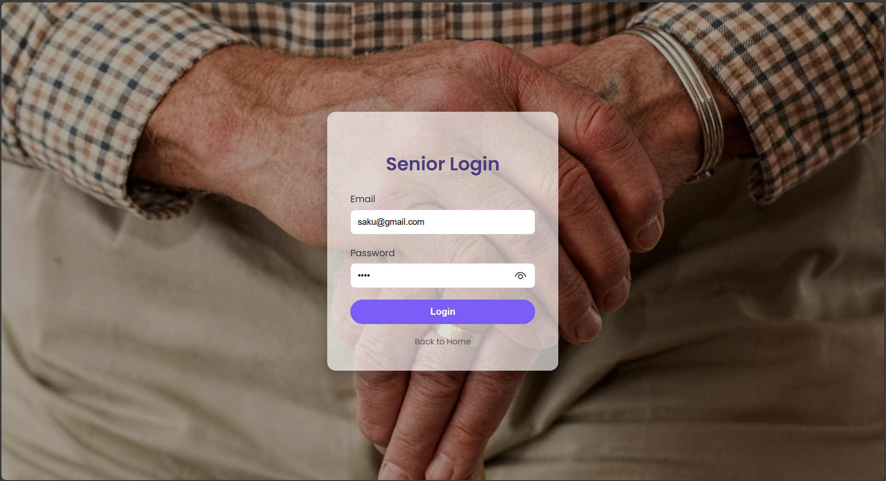
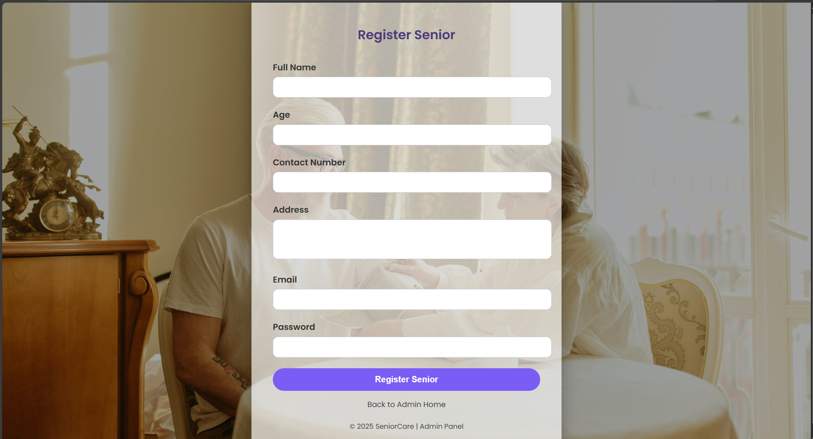
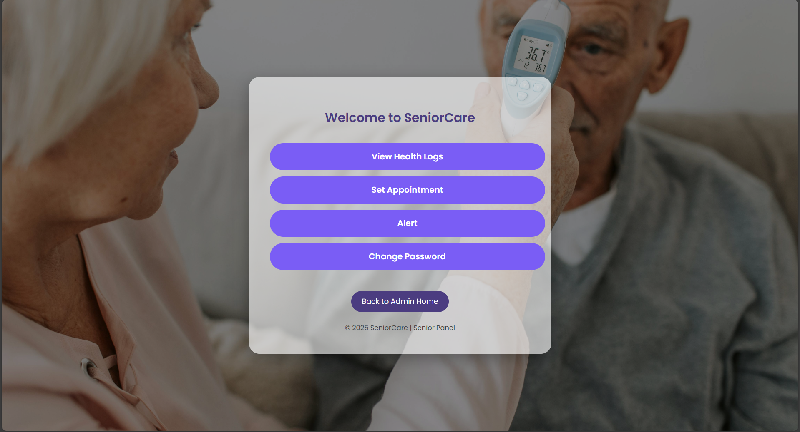
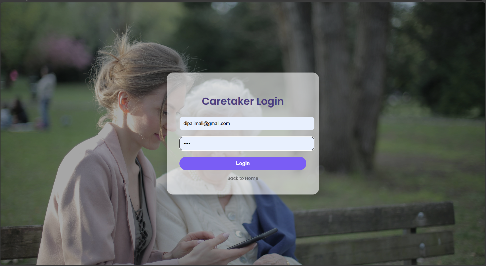
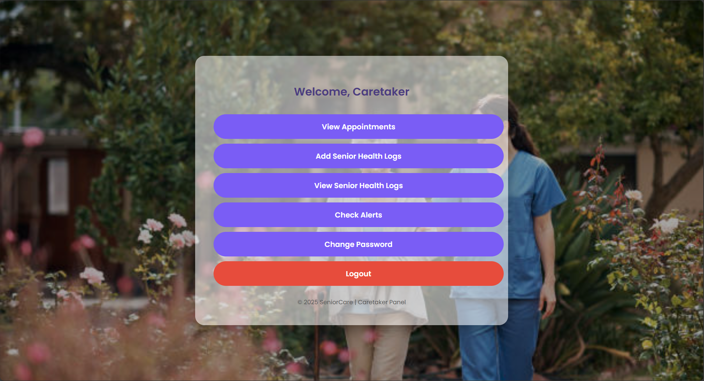
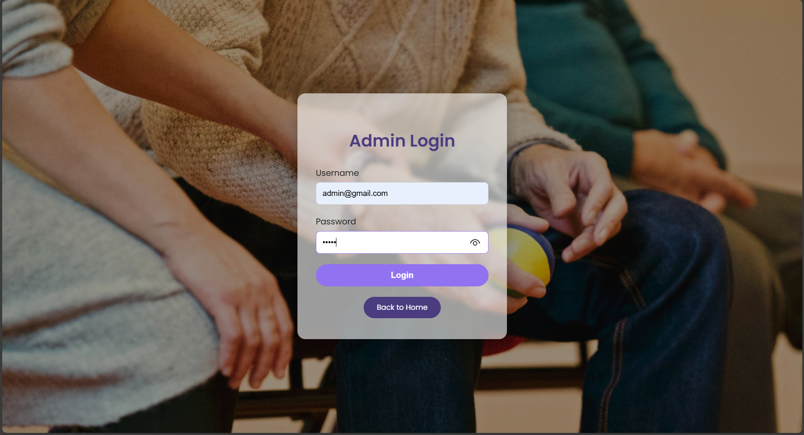
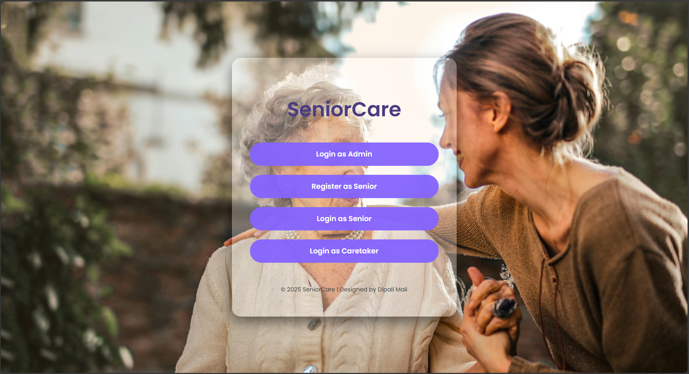
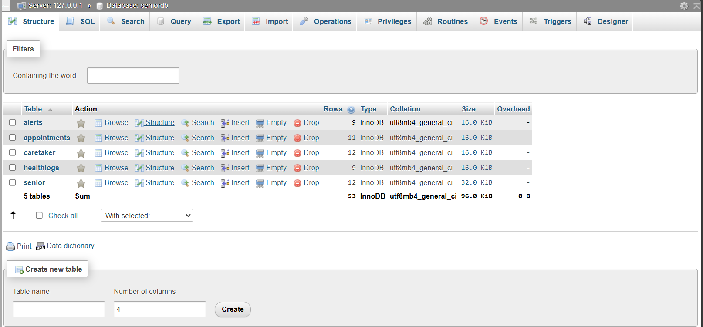

# SeniorCare – Elderly Care Management System

A Full Stack MVC-based Web Application developed using Java, JSP, Servlets and MySQL to manage elderly care services efficiently through secure authentication and structured appointment management.

---

## 📌 Project Overview

SeniorCare is a web-based application designed to streamline elderly care service management. The system enables structured appointment scheduling, secure user authentication, and centralized database-driven service management using MVC architecture.

This project demonstrates backend development, database integration, layered architecture implementation, and real-world web application workflow.

---

## 🎯 Problem Statement

Elderly individuals often face challenges in accessing organized healthcare and appointment services. Traditional systems lack centralized data handling and secure appointment tracking.

SeniorCare provides a structured digital platform to manage elderly care services efficiently and securely.

---

## 🚀 Key Features

- Secure User Registration & Login  
- Role-based Authentication  
- Appointment Scheduling & Management  
- Structured MVC Architecture  
- MySQL Database Integration  
- Form Validation & Data Handling  
- Clean Layered Code Organization  

---

## 🛠 Tech Stack

### 💻 Backend


### 🌐 Frontend


### 🗄 Database


### 🚀 Server


### 🏗 Architecture


---

## 🏗 System Architecture

The project follows the MVC (Model-View-Controller) pattern to ensure separation of concerns:

- **Controller Layer:** Servlets handle HTTP requests and responses.
- **Model Layer:** Java classes represent business entities.
- **DAO Layer:** Handles database interaction using SQL queries.
- **View Layer:** JSP pages render UI components.
- **Database Layer:** MySQL relational schema for data storage.

This layered design improves maintainability, scalability, and code readability.

---

## 📊 Architecture Diagram

Below is the logical flow of the system:

```
User (Browser)
      │
      ▼
JSP Pages (View Layer)
      │
      ▼
Servlets (Controller Layer)
      │
      ▼
Business Logic (Model Layer)
      │
      ▼
DAO Layer
      │
      ▼
MySQL Database
```

### Flow Explanation:

1. User interacts with JSP pages.
2. Request is sent to Servlet (Controller).
3. Controller processes request using Model classes.
4. DAO layer performs SQL operations.
5. Data is retrieved/stored in MySQL database.
6. Response is sent back to user via JSP.

---

## 📂 Project Structure

SeniorCare-Elderly-Management-System  
│  
├── database/  
│   └── seniordb.sql  
│  
├── src/com/seniorcitizen/webpro/  
│   ├── controller  
│   ├── model  
│   ├── dao  
│   └── util  
│  
├── web/  
│   ├── login.jsp  
│   ├── register.jsp  
│   ├── dashboard.jsp  
│   └── appointment.jsp  
│  
└── README.md  

---

## 🗄 Database Design

- Normalized relational schema  
- Primary & Foreign key constraints  
- Structured appointment & user tables  
- Optimized SQL queries  

Database script location:

database/seniordb.sql  

---

## 📸 Screenshots

### 👤 Senior Module

#### 🔐 Senior Login
<p align="center">
  
</p>

#### 📝 Senior Registration
<p align="center">
  
</p>

#### 🏠 Senior Home
<p align="center">
  
</p>

---

### 👩‍⚕ Caretaker Module

#### 🔐 Caretaker Login
<p align="center">
  
</p>

#### 🏠 Caretaker Home
<p align="center">
  
</p>

---

### 🛠 Admin Module

#### 🔐 Admin Login
<p align="center">
  
</p>

#### 🏠 Admin Dashboard
<p align="center">
  
</p>

---

### 📊 System Dashboard

<p align="center">
  
</p>

---

### 🗄 Database Structure

<p align="center">
  
</p>


## ⚙ Installation & Execution Steps

### Step 1 – Install Requirements
- Java JDK (8+)
- Apache Tomcat (v9+)
- MySQL Server
- Eclipse / IntelliJ IDE

### Step 2 – Setup Database
1. Open MySQL
2. Create database:
   CREATE DATABASE seniordb;
3. Import file:
   database/seniordb.sql

### Step 3 – Configure Database
Update DB credentials in:

src/com/seniorcitizen/webpro/util/

### Step 4 – Deploy
1. Import project as Dynamic Web Project
2. Configure Tomcat
3. Deploy project to server
4. Start server

### Step 5 – Run Application
Open browser and visit:

http://localhost:8080/SeniorCare

---

## 📈 Learning Outcomes

- MVC Architecture Implementation
- Java Servlet-based Backend Development
- SQL Integration with Java
- Secure Authentication Handling
- Layered Web Application Design
- Local Deployment & Server Configuration

---

## 🔮 Future Enhancements

- Spring Boot Migration
- REST API Integration
- Role-based Admin Dashboard
- Email Notification System
- Cloud Deployment (AWS / Azure)
- Analytics Dashboard

---

## 👩‍💻 Author

Dipali Mali  
B.Tech Computer Science & Engineering (Data Science)  
Aspiring Data Analyst | Java Developer  

---

⭐ This project demonstrates structured backend development, database integration, and scalable MVC-based web application architecture aligned with industry standards.
